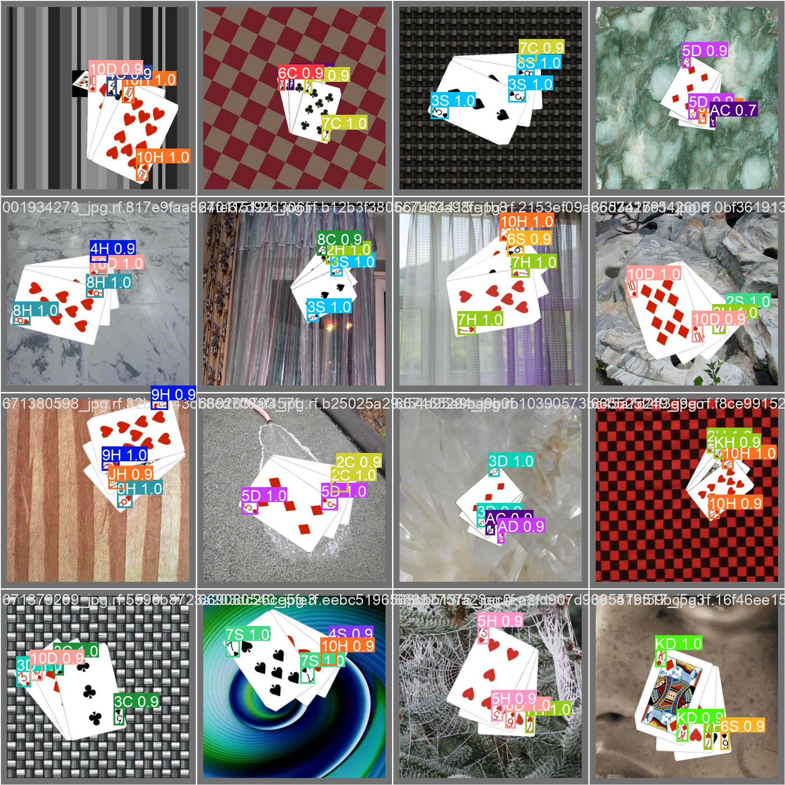
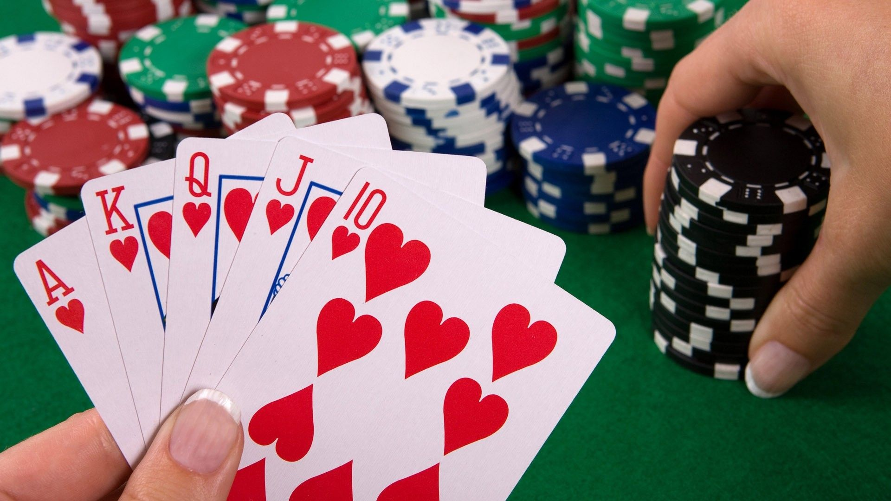
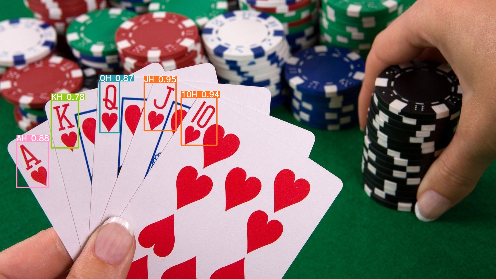

# Playing Cards Detection with YoloV8

This repo uses YoloV8 to detect Playing Cards from image (52 classes)



## Environments and Dependencies

- Python 3.8.16

Install requirements

``` bash
pip install -r requirements.txt
```

## Data

Dataset can be found [here](https://universe.roboflow.com/augmented-startups/playing-cards-ow27d)

## Config

The dataset YAML is the same standard YOLOv5 YAML format. See the [YOLOv5 Train Custom Data tutorial](https://github.com/ultralytics/yolov5/wiki/Train-Custom-Data) for full details.

Modify path or add config with format `.yaml` in `data_config` (Refer [here](https://github.com/ultralytics/yolov5/wiki/Train-Custom-Data#11-create-datasetyaml) for more information)

Sample [`playing_cards.yaml`](./data_config/playing_cards.yaml)

``` yaml
path: ./data/ 
train: train/images # dataset root dir
val: valid/images # train images (relative to 'path')
test: test/images # val images (relative to 'path')

# Classes
names: 
  0: '10C'
  1: '10D'
  2: '10H'
  3: '10S'
  4: '2C'
  ...
```

## Train

Training with CLI

```
yolo task=detect \
     mode=train \
     model=yolov8s.pt \
     data=./data_config/playing_cards.yaml \
     epochs=10 \
     batch=32 \
     device=0 \
     imgsz=416 
```

See a full list of available `yolo` [arguments](https://docs.ultralytics.com/config/) in the YOLOv8 [Docs](https://docs.ultralytics.com).

## Experiment results

With 10 epochs for each experiments

| Models | mAP50 | mAP50:95 | Size |
|:---:|:---:|:---:|:---:|
| [yolov8s](https://drive.google.com/file/d/1AqZnW6dI6flFZvGxAn6A9apDNSviXZ5f/view?usp=share_link) | 0.99498 | 0.95681 | 22.0MB |

## Detect

Simply download pretrained weight and run

```
yolo task=detect mode=predict model="./yolov8s_playing_cards.pt" source="./assets/test.jpg"
```

And you will get the result

| Input Image | Result Image |
| --- | --- |
|  |  |


## Easy infer

For easy infer and get information, run

```
python infer.py
```

## Reference

- [ultralytics](https://github.com/ultralytics/ultralytics)
